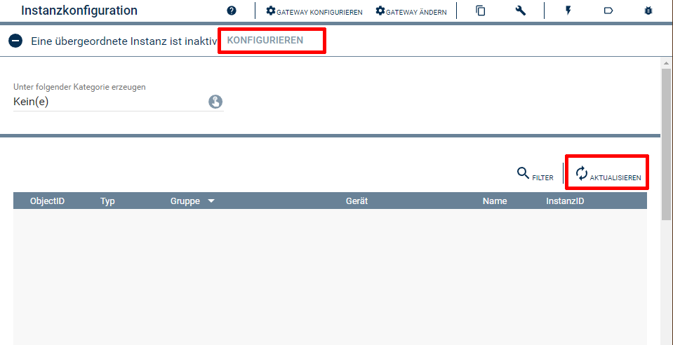

  

  
  

# PRTG Konfigurator  <!-- omit in toc -->
Vereinfacht das Anlegen von Geräte und Sensor Instanzen in IPS.  

## Inhaltsverzeichnis <!-- omit in toc -->

- [1. Funktionsumfang](#1-funktionsumfang)
- [2. Installation](#2-installation)
- [3. Einrichten der Instanzen in IP-Symcon](#3-einrichten-der-instanzen-in-ip-symcon)
- [4. Statusvariablen und Profile](#4-statusvariablen-und-profile)
- [5. WebFront](#5-webfront)
- [6. PHP-Befehlsreferenz](#6-php-befehlsreferenz)
- [7. Lizenz](#7-lizenz)

## 1. Funktionsumfang

 - Auslesen und darstellen aller in PRTG und IPS bekannten Geräte und Sensoren.  
 - Einfaches Anlegen von neuen Instanzen in IPS.  

## 2. Installation

 Dieses Modul ist Bestandteil der [PRTG-Library](../README.md#3-software-installation).  

## 3. Einrichten der Instanzen in IP-Symcon

Nach der installation durch den Modul Store erfolgt eine abfrage ob das enthaltende Konfigurator Modul angelegt werden soll.  
Alternativ ist das Modul im Dialog 'Instanz hinzufügen' unter dem Hersteller 'PRTG' zu finden.  
  

Es wird automatisch eine PRTG-IO Instanz erzeugt, wenn noch keine vorhanden ist.  
Erscheint im dem sich öffnenden Konfigurationsformular der Hinweis 'Eine übergeordnete Instanz ist inaktiv', so ist zuerst der IO zu konfigurieren.  
  
Dieser kann über die Schaltfläche 'Gateway konfigurieren' erreicht werden.  
Details zur Konfiguration des [IO](../PRTGIO/README.md#4-einrichten-der-instanzen-in-ip-symcon) sind der Dokumentation des [IO](../PRTGIO/README.md#4-einrichten-der-instanzen-in-ip-symcon) zu entnehmen.

Ist der [IO](../PRTGIO/README.md#4-einrichten-der-instanzen-in-ip-symcon) korrekt verbunden, wird beim öffnen des Konfigurator oder nach dem betätigen der Schaltfläche 'Aktualisieren', folgender Dialog angezeigt.  
Über das selektieren eines Eintrages in der Tabelle und betätigen des dazugehörigen 'Erstellen' Button,  können einzelne Instanzen in IPS angelegt werden.  
Alternativ können auch alle fehlenden Instanzen auf einmal erstellt werden.  
Erstelle Instanzen werden unterhalb einer Kategorie mit dem Namen des jeweiligen Gerätes erstellt.  
Diese Kategorien werden im logischen Baum direkt im Root erstellt.  
Es kann jedoch eine andere Ursprungskategorie ausgewählt werden.  
Diese Struktur dient dem schellen auffinden der erstellten Instanzen im logischen Baum, anschließend können die Instanzen frei im Baum verschoben werden.  
  

## 4. Statusvariablen und Profile

Der Konfigurator besitzt keine Statusvariablen und Variablenprofile.  

## 5. WebFront

Der Konfigurator besitzt keine im WebFront darstellbaren Elemente.  

## 6. PHP-Befehlsreferenz

Der Konfigurator besitzt keine Instanz-Funktionen.  

## 7. Lizenz

  IPS-Modul:  
  [CC BY-NC-SA 4.0](https://creativecommons.org/licenses/by-nc-sa/4.0/)  
