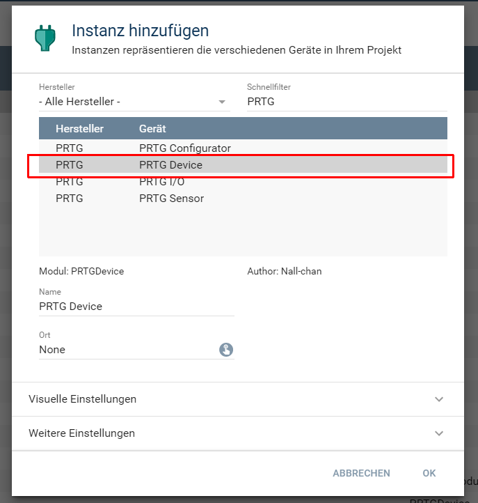
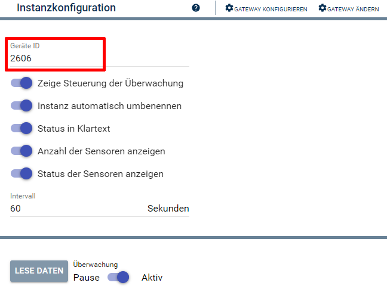
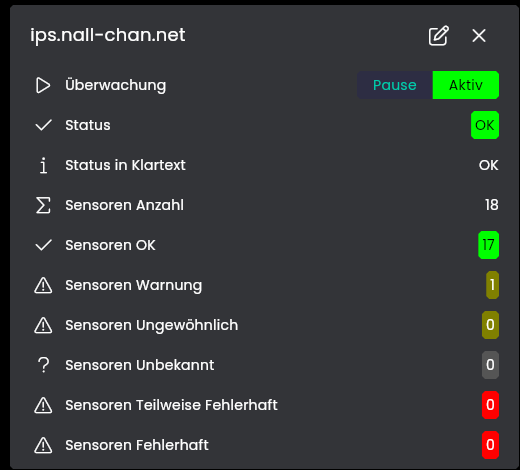
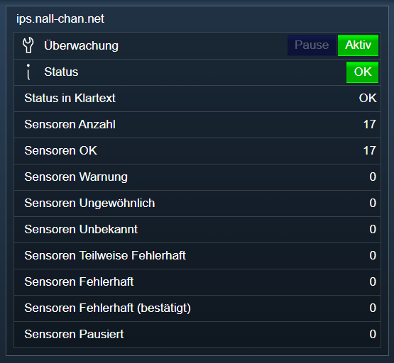
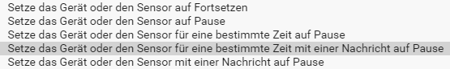

[](https://www.symcon.de/service/dokumentation/entwicklerbereich/sdk-tools/sdk-php/)
[](https://community.symcon.de/t/modul-prtg-prtg-in-ips-einbinden-und-ips-in-prtg-ueberwachen/47105)
[](https://www.symcon.de/de/service/dokumentation/installation/migrationen/v80-v81-q3-2025/)  
[](https://creativecommons.org/licenses/by-nc-sa/4.0/)
[](https://github.com/Nall-chan/PRTG/actions)
[](https://github.com/Nall-chan/PRTG/actions)  
[](#2-spenden)[](#2-spenden)  

Einbindung eines PRTG-Gerätes in IPS.  

## Inhaltsverzeichnis <!-- omit in toc -->

- [1. Funktionsumfang](#1-funktionsumfang)
- [2. Installation](#2-installation)
- [3. Einrichten der Instanzen in IP-Symcon](#3-einrichten-der-instanzen-in-ip-symcon)
- [4. Statusvariablen](#4-statusvariablen)
- [5. Visualisierung](#5-visualisierung)
- [6. Aktionen](#6-aktionen)
- [7. PHP-Befehlsreferenz](#7-php-befehlsreferenz)
- [8. Anhang](#8-anhang)
  - [1. Changelog](#1-changelog)
  - [2. Spenden](#2-spenden)
- [9. Lizenz](#9-lizenz)

## 1. Funktionsumfang

- Empfangen und darstellen des aktuellen Zustand.  
- Pausieren und Fortsetzen der Überwachung über die Frontends, Aktionen und PHP-Scripten.  

## 2. Installation

Dieses Modul ist Bestandteil der [PRTG-Library](../README.md#3-software-installation).  

## 3. Einrichten der Instanzen in IP-Symcon

Das Anlegen von neuen Instanzen kann komfortabel über den [PRTG Konfigurator:](../PRTGConfigurator/README.md#3-einrichten-der-instanzen-in-ip-symcon) erfolgen.  

Alternativ ist das Modul im Dialog 'Instanz hinzufügen' unter dem Hersteller 'PRTG' zu finden.  
  

Es wird automatisch ein PRTGIO Instanz erzeugt, wenn noch keine vorhanden ist.  
Erscheint im dem sich öffnenden Konfigurationsformular der Hinweis 'Eine übergeordnete Instanz ist inaktiv', so ist zuerst der [IO](../PRTGIO/README.md#4-einrichten-der-instanzen-in-ip-symcon) zu konfigurieren.  
Dieser kann über die Schaltfläche 'Gateway konfigurieren' erreicht werden.  
Details zur Konfiguration des [IO](../PRTGIO/README.md#4-einrichten-der-instanzen-in-ip-symcon) sind der Dokumentation des [IO](../PRTGIO/README.md#4-einrichten-der-instanzen-in-ip-symcon) zu entnehmen.

Folgende Parameter sind in der Instanz zu konfigurieren:  

  

**Konfigurationsseite:**  

| Eigenschaft         |   Typ   | Standardwert | Funktion                                          |
| :------------------ | :-----: | :----------: | :------------------------------------------------ |
| id                  | integer |              | PRTG ObjektID des Gerätes                         |
| AutoRename          |  bool   |     true     | Instanz automatisch an den Namen in PRTG anpassen |
| ShowActionButton    |  bool   |     true     | Aktionsbutton zum pausieren der Überwachung       |
| ReadableState       |  bool   |     true     | Status als Klartext in String-Variable            |
| DisplaySensorState  |  bool   |     true     | Statusvariablen für Zustände des Sensoren         |
| DisplayTotalSensors |  bool   |     true     | Statusvariablen mit Anzahl aller Sensoren         |
| Interval            | integer |      60      | Abfrageintervall in Sekunden                      |

## 4. Statusvariablen

Folgende Statusvariablen werden automatisch angelegt.  

| Name                            |   Typ   | Ident           | Beschreibung                                                  |
| :------------------------------ | :-----: | :-------------- | :------------------------------------------------------------ |
| Status                          | integer | State           | Status des Gerätes                                            |
| Status Klartext                 | string  | ReadableState   | Status des Gerätes als String wie er von PRTG übertragen wird |
| Steuerung                       | integer | ActionButton    | Pause / Resume Button zum Steuern der Überwachung             |
| Sensoren Anzahl                 | integer | TotalSens       | Anzahl aller Sensoren des Gerätes                             |
| Sensoren OK                     | integer | UpSens          | Anzahl der Sensoren im Zustand OK                             |
| Sensoren Warnung                | integer | WarnSens        | Anzahl der Sensoren im Zustand Warnung                        |
| Sensoren Ungewöhnlich           | integer | UnusualSens     | Anzahl der Sensoren im Zustand Ungewöhnliche Daten            |
| Sensoren Unbekannt              | integer | UndefinedSens   | Anzahl der Sensoren im Zustand Unbekannt                      |
| Sensoren Teilweise Fehlerhaft   | integer | PartialDownSens | Anzahl der Sensoren im Zustand Teilweise Fehlerhaft           |
| Sensoren Fehlerhaft             | integer | DownSens        | Anzahl der Sensoren im Zustand Fehlerhaft                     |
| Sensoren Fehlerhaft (bestätigt) | integer | DownAckSens     | Anzahl der Sensoren im Zustand Fehlerhaft (bestätigt)         |
| Sensoren Pausiert               | integer | PausedSens      | Anzahl der Sensoren im Zustand Pausiert                       |

## 5. Visualisierung

Die direkte Darstellung und Steuerung in der Kachel-Visu und dem WebFront ist möglich.  
  
  

## 6. Aktionen

**Grundsätzlich können alle bedienbaren Statusvariablen als Ziel einer [`Aktion`](https://www.symcon.de/service/dokumentation/konzepte/automationen/ablaufplaene/aktionen/) mit 'Auf Wert schalten' angesteuert werden, so das hier keine speziellen Aktionen benutzt werden müssen.**

Dennoch gibt es diverse Aktionen für die `PRTG Device` Instanz.  
Wenn so eine Instanz als Ziel einer Aktion ausgewählt wurde, stehen folgende Aktionen zur Verfügung:  
  

## 7. PHP-Befehlsreferenz

```php
bool PRTG_RequestState(integer $InstanzID)
```  

Liest den Zustand des Gerätes von PRTG.  
Wurde der Befehl erfolgreich ausgeführt, wird `true` zurück gegeben.  
Im Fehlerfall wird eine Warnung erzeugt und `false`zurück gegeben.  

---

```php
bool PRTG_SetResume(integer $InstanzID)
```  

Setzt die Überwachung des Gerätes in PRTG fort.  
Wurde der Befehl erfolgreich ausgeführt, wird `true` zurück gegeben.  
Im Fehlerfall wird eine Warnung erzeugt und `false`zurück gegeben.  

---

```php
bool PRTG_SetPause(integer $InstanzID)
```

Pausiert die Überwachung des Gerätes in PRTG.  
Wurde der Befehl erfolgreich ausgeführt, wird `true` zurück gegeben.  
Im Fehlerfall wird eine Warnung erzeugt und `false`zurück gegeben.  

---

```php
bool PRTG_SetPauseEx(integer $InstanzID, string $Message)
```

Pausiert die Überwachung des Gerätes in PRTG mit einer in '$Message' übergebenen Meldung.  
Wurde der Befehl erfolgreich ausgeführt, wird `true` zurück gegeben.  
Im Fehlerfall wird eine Warnung erzeugt und `false`zurück gegeben.  

---

```php
bool PRTG_SetPauseDuration(integer $InstanzID, integer $Minutes)
```

Pausiert die Überwachung des Gerätes in PRTG für die in '$Minutes' angegebene Zeit in Minuten.  
Wurde der Befehl erfolgreich ausgeführt, wird `true` zurück gegeben.  
Im Fehlerfall wird eine Warnung erzeugt und `false`zurück gegeben.  

---

```php
bool PRTG_SetPauseDurationEx(integer $InstanzID, integer $Minutes, string $Message)
```

Pausiert die Überwachung des Gerätes in PRTG mit einer in '$Message' übergebenen Meldung für die in '$Minutes' angegebene Zeit in Minuten.  
Wurde der Befehl erfolgreich ausgeführt, wird `true` zurück gegeben.  
Im Fehlerfall wird eine Warnung erzeugt und `false`zurück gegeben.  

## 8. Anhang

### 1. Changelog

[Changelog der Library](../README.md#3-changelog)  

### 2. Spenden  
  
Die Library ist für die nicht kommerzielle Nutzung kostenlos, Schenkungen als Unterstützung für den Autor werden hier akzeptiert:  

[](https://paypal.me/Nall4chan)  

[](https://www.amazon.de/hz/wishlist/ls/YU4AI9AQT9F?ref_=wl_share)  

## 9. Lizenz

IPS-Modul:  
[CC BY-NC-SA 4.0](https://creativecommons.org/licenses/by-nc-sa/4.0/)  
