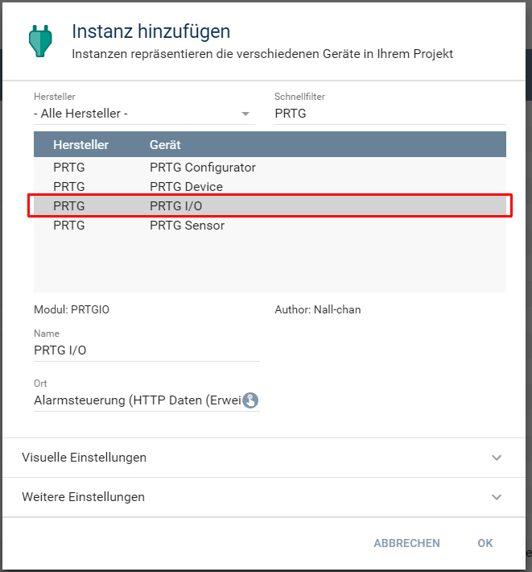
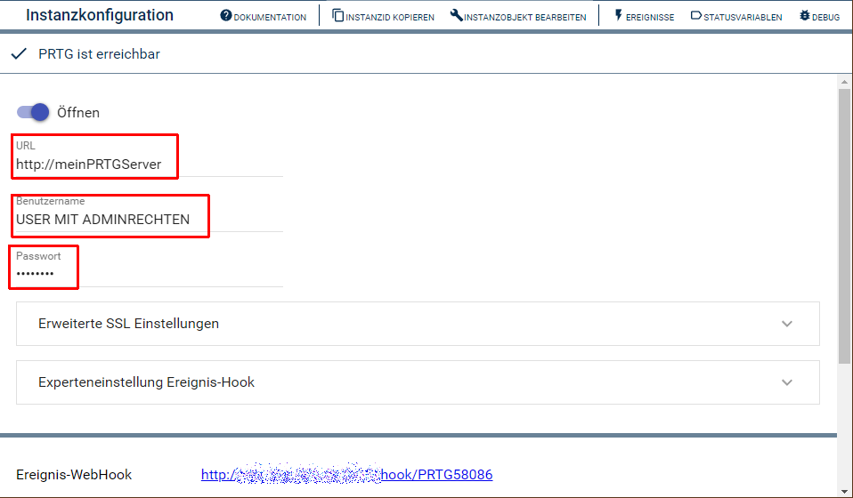
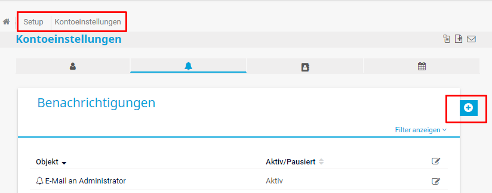
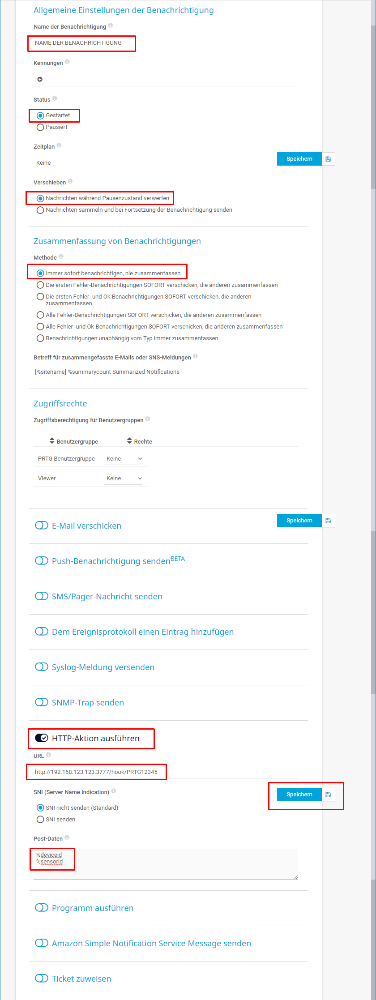
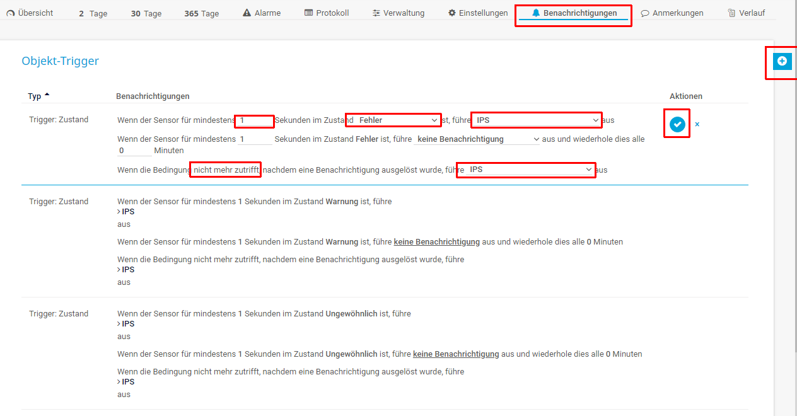
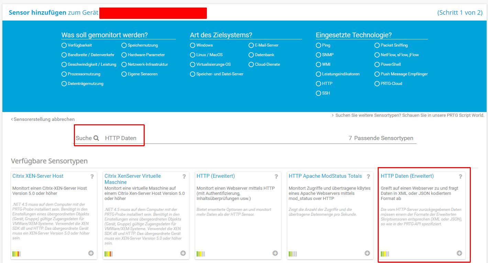
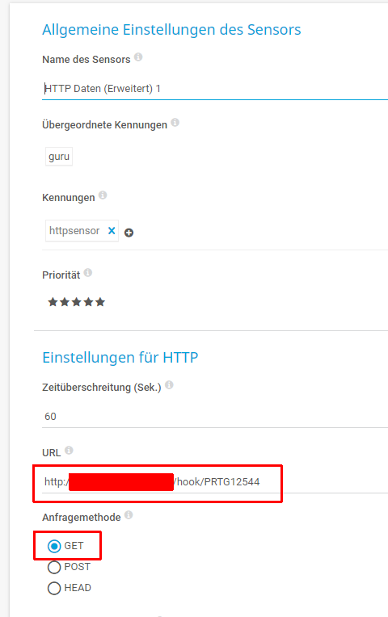
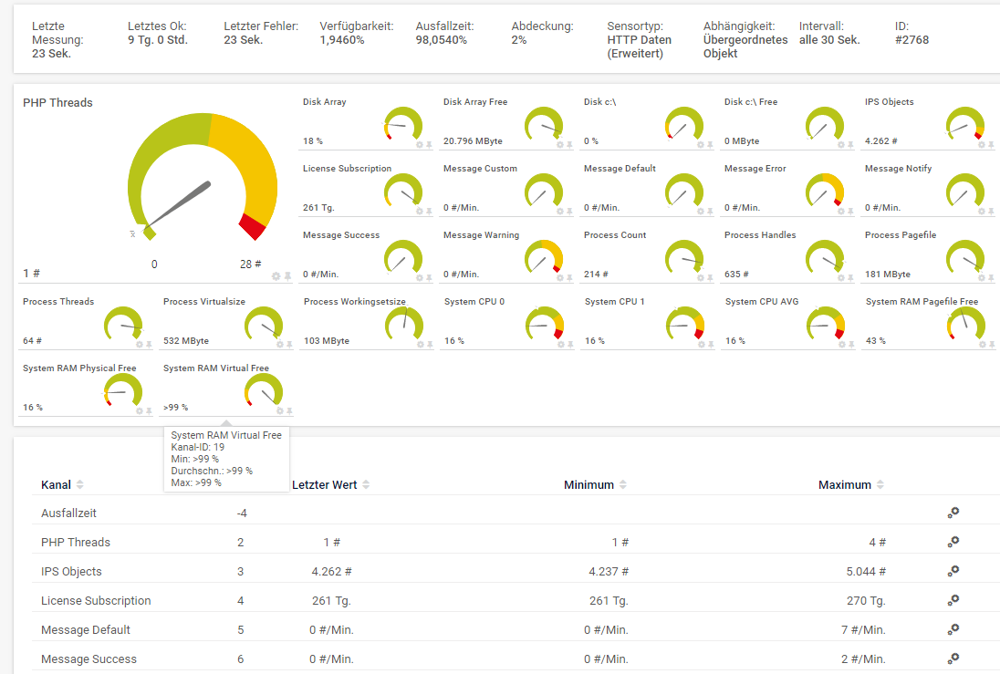

[](https://www.symcon.de/service/dokumentation/entwicklerbereich/sdk-tools/sdk-php/)
[]()
[](https://creativecommons.org/licenses/by-nc-sa/4.0/)  
[](https://www.symcon.de/forum/threads/30857-IP-Symcon-5-1-%28Stable%29-Changelog)
[](https://styleci.io/repos/132882302)  

# PRTG I/O
I/O zur Kommunikation mit PRTG  

## Dokumentation

**Inhaltsverzeichnis**

1. [Funktionsumfang](#1-funktionsumfang)  
2. [Voraussetzungen](#2-voraussetzungen)  
3. [Software-Installation](#3-software-installation) 
4. [Einrichten der Instanzen in IP-Symcon](#4-einrichten-der-instanzen-in-ip-symcon)
5. [Statusvariablen und Profile](#5-statusvariablen-und-profile)
6. [WebFront](#6-webfront)
7. [PHP-Befehlsreferenz](#7-php-befehlsreferenz) 
8. [Anhang](#8-anhang)  
    1. [Events von PRTG empfangen](#1-events-von-prtg-empfangen)  
    2. [IPS in PRTG überwachen](#2-ips-in-prtg--berwachen)  
    3. [Changelog](#3-changelog)  
9. [Lizenz](#9-lizenz)

## 1. Funktionsumfang

 - Schnittstelle zwischen den Device und Sensor Instanzen und PRTG.  
 - Empfangen von Events aus PRTG.  
 - Bereitstellen von IPS Systeminformation für einen PRTG-Sensor.  
 - Abfragen von Graphen aus PRTG.  

## 2. Voraussetzungen

 - IPS 5.1 oder höher  
 - PRTG

## 3. Software-Installation

 Dieses Modul ist Bestandteil der [PRTG-Library](../).  

**IPS 5.1:**  
   Bei privater Nutzung:
     Über den 'Module-Store' in IPS.  
   **Bei kommerzieller Nutzung (z.B. als Errichter oder Integrator) wenden Sie sich bitte an den Autor.**  

## 4. Einrichten der Instanzen in IP-Symcon

Diese Instanz wird automatisch erzeugt sobald z.B. der [PRTG Konfigurator:](../PRTGConfigurator/) erstellt wird.  

Alternativ ist das Modul im Dialog 'Instanz hinzufügen' unter dem Hersteller 'PRTG' zufinden.  
  

Folgende Parameter sind in der Instanz zu konfigurieren:  
Dabei sollte der Benutzer in PRTG Administrative Rechte bekommen, um die Überwachung zu steuern und Alarme quittieren zu können.  
Die Erweiterten SSL Einstellungen sind per default deaktiv.  Für z.B. selbst-signierte Zertifikate sind z.B. Option 1 und 2 zu aktiviern.  

  
**Konfigurationsseite:**  

| Eigenschaft         | Typ     | Standardwert | Funktion                                                               |
| :-----------------: | :-----: | :----------: | :--------------------------------------------------------------------: |
| Open                | bool    | false        | I/O öffnen oder schließen                                              |
| Host                | string  |              | URL zum PRTG Webfront z.B. http://prtg:8081                            |
| Username            | string  |              | Benutzername in PRTG                                                   |
| Password            | string  |              | Passwort für den Benutzer                                              |
| NoHostVerify        | bool    |              | Deaktiviere Prüfung des Hostnamen                                      |
| NoPeerVerify        | bool    |              | Deaktiviere Prüfung der Gegenstelle                                    |
| NoCertCheck         | bool    |              | Deaktiviere Prüfung des Zertifikat                                     |

## 5. Statusvariablen und Profile

Der I/O legt keine Statusvariablen und Profile an.  

## 6. WebFront

Entfällt.  

## 7. PHP-Befehlsreferenz

```php
bool PRTG_GetGraph(integer $InstanzID, integer $Type, integer $SensorId, integer $GraphId, integer $Width, integer $Height, integer $Theme, integer $BaseFontSize, bool $ShowLegend)
```
Liefert ein PNG oder SVG Bild eines Graphen als String.  
Im Fehlerfall wird eine Warnung erzeugt und `false`zurück gegeben.  
Folgende Parameter stehen zur Verfügung:  
 - $Type 1=PNG, 2=SVG  
 - $SensorId Objekt-ID des Sensors  
 - $GraphId Zeitbereich des Graphen: 0=live, 1=last 48 hours, 2=30 days, 3=365 days  
 - $Width Höhe des Graphen in Pixel.  
 - $Height Höhe des Graphen in Pixel.  
 - $Theme Darstellungstheme (0,1,2,3)  
 - $BaseFontSize Schriftgröße, 10 ist Standard.  
 - $ShowLegend true für Legende Anzeigen, fals zum verbergen.  

## 8. Anhang

### 1. Events von PRTG empfangen  

PRTG kann bei Statusänderungen eines Sensors eine Benachrichtigung an IPS senden, damit IPS den Zustand zeitnah darstellen kann und nicht um das Abfrageintervall verzögert in IPS dargestellt wird.  
  
Hierzu zum zuerst in PRTG eine neue Benachrichtigung angelegt werden, mit folgenden Parametern:  
Name: beliebig  z.B. IPS
Status: gestartet  
Verschieben: Nachrichten während Pausenzustand verwerfen  
Methode: Immer sofort benachrichtigen, nie zusammenfassen.  
HTTP-Aktion ausführen: URL von IPS nach folgendem Schema eintragen:  
```
http://<ips-ip>:<ips-port>/hook/PRTG<InstanzID>
```
z.B. http://192.168.123.123:3777/hook/PRTG12345  

Post-Daten:  
```
%deviceid
%sensorid
```
  
Anschließend müssen noch Trigger definiert werden, welche diese Benachrichtigung auslösen.  
PRTG vererbt Konfigurationen vom obersten Element nach unten. Somit können einzelne Objekte diese Benachrichtigung auslösen, oder auch alle.  
Soll die Benachrichtung für alle Sensoren erfolgen, so ist werden die Trigger im Objekt 0 (oberstes Element im Gerätebaum von PRTG) unter Benachrichtigungen angelegt.  

Hier sind vier Trigger anzulegen für die Zustände 'Fehler', 'Warnung', 'Ungewöhnlich' und 'Fehler (teilweise)'.  
Als Aktion wird immer die oben erzeugte Benachrichtigung ausgewählt. Auch wenn die Bedingung nicht mehr zutrifft.  
Wird in IPS eine Benachrichtigung empfange, so wird dies im Reiter Debug mit 'PRTG EVENT' ausgegeben.  
  

### 2. IPS in PRTG überwachen  

Die Instant stellt einen HTTP-Sensor für PRTG bereit welcher wie folgt in PRTG eingebunden werden kann:  
- Unterhalb des gewünschten Gerätes einen neuen Sensor hinzufügen.  
- Im Suchfeld 'HTTP Daten' eingeben und den Sensor 'HTTP Daten (Erweitert)' auswählen.  
- Als URL wird wieder der Webhook eingetragen:  
   'http://<ips-ip>:<ips-port>/hook/PRTG<InstanzID>'  
   z.B. http://192.168.123.123:3777/hook/PRTG12345  
- Anfragemethode bleibt auf GET  

Nach dem erzeugen und speichern der Sensoreinstellungen dauert es einen Augenblick bis PRTG die ersten Werte darstellt.  
  
  
  


### 3. Changelog  

Version 2.00:  
 - Release für IPS 5.1 und den Module-Store   

Version 1.31:
 - Darstellungsfehler im Konfigurator beseitigt  
 - Formen nutzen jetzt NumberSpinner mit Suffix anstatt IntervalBox  

Version 1.30:  
 - Fehlerbehandlung Datenaustausch überarbeitet  

Version 1.1:  
 - SSL Checks sind deaktivierbar  

Version 1.0:  
 - Erstes offizielles Release  

## 9. Lizenz

  IPS-Modul:  
  [CC BY-NC-SA 4.0](https://creativecommons.org/licenses/by-nc-sa/4.0/)  
