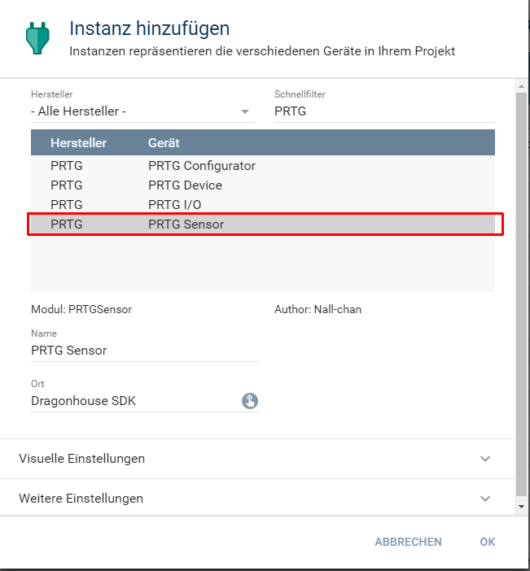
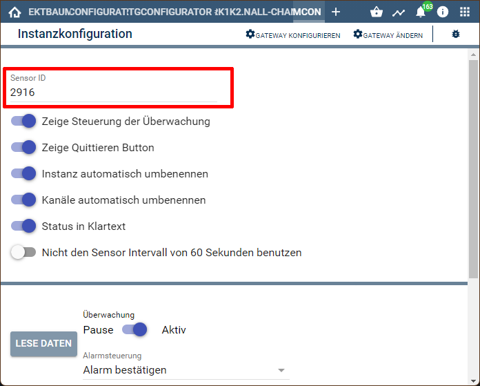
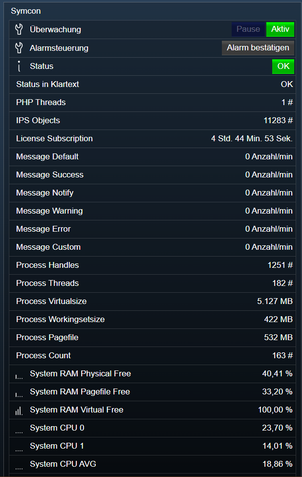

[](https://www.symcon.de/service/dokumentation/entwicklerbereich/sdk-tools/sdk-php/)
[]()
[](https://creativecommons.org/licenses/by-nc-sa/4.0/)  
[](https://www.symcon.de/forum/threads/37412-IP-Symcon-5-0-%28Testing%29)

# PRTG Device
Einbindung eines PRTG-Sensors in IPS.  

## Dokumentation

**Inhaltsverzeichnis**

1. [Funktionsumfang](#1-funktionsumfang)  
2. [Voraussetzungen](#2-voraussetzungen)  
3. [Software-Installation](#3-software-installation) 
4. [Einrichten der Instanzen in IP-Symcon](#4-einrichten-der-instanzen-in-ip-symcon)
5. [Statusvariablen und Profile](#5-statusvariablen-und-profile)
6. [WebFront](#6-webfront)
7. [PHP-Befehlsreferenz](#7-php-befehlsreferenz) 
8. [Anhang](#8-anhang)  
9. [Lizenz](#9-lizenz)

## 1. Funktionsumfang

 - Empfangen und darstellen des aktuellen Zustand in IPS.  
 - Pausieren und Fortsetzen der Überwachung aus IPS über WebFront und PHP-Scripten.  
 - Quittieren von Alarmmeldungen aus IPS über WebFront und PHP-Scripten.  

## 2. Voraussetzungen

 - IPS 5.0 oder höher  
 - PRTG

## 3. Software-Installation

 Dieses Modul ist Bestandteil der IPSPRTG-Library.

**IPS 5.0:**  
   Bei privater Nutzung: Über das 'Module-Control' in IPS folgende URL hinzufügen.  
    `git://github.com/Nall-chan/IPSPRTG.git`  

   **Bei kommerzieller Nutzung (z.B. als Errichter oder Integrator) wenden Sie sich bitte an den Autor.**  

## 4. Einrichten der Instanzen in IP-Symcon

Das Anlegen von neuen Instanzen kann komfortabel über den [PRTG Konfigurator:](../PRTGConfigurator/) erfolgen.  

Alternativ ist das Modul im Dialog 'Instanz hinzufügen' unter dem Hersteller 'PRTG' zufinden.  
  

Es wird automatisch ein PRTGIO Instanz erzeugt, wenn noch keine vorhanden ist.  
Erscheint im dem sich öffnenden Konfigurationsformular der Hinweis 'Eine übergeordnete Instanz ist inaktiv', so ist zuerst der IO zu konfigurieren.  
Dieser kann über die Schaltfläche 'Gateway konfigurieren' erreicht werden.  
Details zur Konfiguration des IO sind der Dokumentation des IO zu entnehmen.

Folgende Parameter sind in der Instanz zu konfigurieren:  
  
**Konfigurationsseite:**  

| Eigenschaft         | Typ     | Standardwert | Funktion                                                               |
| :-----------------: | :-----: | :----------: | :--------------------------------------------------------------------: |
| id                  | integer |              | PRTG ObjektID des Sensor                                               |
| AutoRename          | bool    | true         | Instanz automatisch an den Namen in PRTG anpassen                      |
| ShowActionButton    | bool    | true         | Aktionsbutton zum pausieren der Überwachung                            |
| ShowAckButton       | bool    | true         | Aktionsbutton zum Quittieren des Alarm                                 |
| ReadableState       | bool    | true         | Status als Klartext in String-Variable                                 |
| AutoRenameChannels  | bool    | true         | Statusvariablen der Kanäle automatisch an den Namen in PRTG anpassen   |
| UseInterval         | bool    | true         | Abfrageintervall aus Interval benutzen, sonst PRTG-Intervall nutzen    |
| Interval            | integer | 60           | Abfrageintervall in Sekunden                                           |

## 5. Statusvariablen und Profile

Folgende Statusvariablen werden automatisch angelegt.  
Zusätzlich werden dynamisch Statusvariablen für die einzelen Kanäle erstellt.  

| Name                              | Typ     | Ident           | Beschreibung                                                  |
| :-------------------------------: | :-----: | :-------------: | :-----------------------------------------------------------: |
| Status                            | integer | State           | Status des Sensor                                             |
| Status Klartext                   | string  | ReadableState   | Status des Sensor als String wie er von PRTG übertragen wird  |
| Steuerung                         | integer | ActionButton    | Pause / Resume Button zum Steuern der Überwachung             |
| Alarmsteuerung                    | integer | AckButton       | Bestätigen Button zum Quittieren des Alarm                    |


**Profile**:

| Name            | Typ     | verwendet von Statusvariablen |
| :-------------: | :-----: | :---------------------------: |
| PRTG.Sensor     | integer | State                         |
| PRTG.Action     | integer | ActionButton                  |
| PRTG.Ack        | integer | AckButton                     |
| PRTG.ms         | float   | Sensorvariablen               |
| PRTG.Intensity  | float   | Sensorvariablen               |
| PRTG.No         | integer | Sensorvariablen               |
| PRTG.MByte      | float   | Sensorvariablen               |
| PRTG.Sec        | integer | Sensorvariablen               |
| PRTG.MBitSec    | integer | Sensorvariablen               |
| PRTG.kBitSec    | integer | Sensorvariablen               |
| PRTG.IpS        | integer | Sensorvariablen               |
| PRTG.IpM        | integer | Sensorvariablen               |
| PRTG.Items      | integer | Sensorvariablen               |

## 6. WebFront

Die direkte Darstellung und Steuerung im WebFront ist möglich.  
Hier ein Beispiel eines HTTP Sensors für IPS.  
  


## 7. PHP-Befehlsreferenz

```php
bool PRTG_RequestState(integer $InstanzID)
```
Liest den Zustand des Gerätes von PRTG.  
Wurde der Befehl erfolgreich ausgeführt, wird `true` zurück gegeben.  
Im Fehlerfall wird eine Warnung erzeugt und `false`zurück gegeben.  

```php
bool PRTG_SetResume(integer $InstanzID)
```
Setzt die Überwachung des Gerätes in PRTG fort.  
Wurde der Befehl erfolgreich ausgeführt, wird `true` zurück gegeben.  
Im Fehlerfall wird eine Warnung erzeugt und `false`zurück gegeben.  

```php
bool PRTG_SetPause(integer $InstanzID)
```
Pausiert die Überwachung des Gerätes in PRTG.  
Wurde der Befehl erfolgreich ausgeführt, wird `true` zurück gegeben.  
Im Fehlerfall wird eine Warnung erzeugt und `false`zurück gegeben.  

```php
bool PRTG_SetPauseEx(integer $InstanzID, string $Message)
```
Pausiert die Überwachung des Gerätes in PRTG mit einer in '$Message' übergebenen Meldung.  
Wurde der Befehl erfolgreich ausgeführt, wird `true` zurück gegeben.  
Im Fehlerfall wird eine Warnung erzeugt und `false`zurück gegeben.  

```php
bool PRTG_SetPauseDuration(integer $InstanzID, integer $Minutes)
```
Pausiert die Überwachung des Gerätes in PRTG für die in '$Minutes' angegebene Zeit in Minuten.  
Wurde der Befehl erfolgreich ausgeführt, wird `true` zurück gegeben.  
Im Fehlerfall wird eine Warnung erzeugt und `false`zurück gegeben.  

```php
bool PRTG_SetPauseDurationEx(integer $InstanzID, integer $Minutes, string $Message)
```
Pausiert die Überwachung des Gerätes in PRTG mit einer in '$Message' übergebenen Meldung für die in '$Minutes' angegebene Zeit in Minuten.  
Wurde der Befehl erfolgreich ausgeführt, wird `true` zurück gegeben.  
Im Fehlerfall wird eine Warnung erzeugt und `false`zurück gegeben.  

```php
bool PRTG_AcknowledgeAlarm(integer $InstanzID)
```
Bestätigt den Alarm des Sensor in PRTG.  
Wurde der Befehl erfolgreich ausgeführt, wird `true` zurück gegeben.  
Im Fehlerfall wird eine Warnung erzeugt und `false`zurück gegeben.  

```php
bool PRTG_AcknowledgeAlarmEx(integer $InstanzID, string $Message)
```
Bestätigt den Alarm des Sensor in PRTG mit einer in '$Message' übergebenen Meldung.  
Wurde der Befehl erfolgreich ausgeführt, wird `true` zurück gegeben.  
Im Fehlerfall wird eine Warnung erzeugt und `false`zurück gegeben.  

## 8. Anhang

**Changlog:** 

 Version 1.30:  
 - Fehlerbehandlung Datenaustausch überarbeitet  

Version 1.20:  
 - Sensordaten eines SSL-Zertifikatssensor verursachten Fehler  

Version 1.10:  
 - Sensorwerte mit Laufzeit Tage verursachten Fehler  

Version 1.0:  
 - Erstes offizielles Release  

## 9. Lizenz

  IPS-Modul:  
  [CC BY-NC-SA 4.0](https://creativecommons.org/licenses/by-nc-sa/4.0/)  
