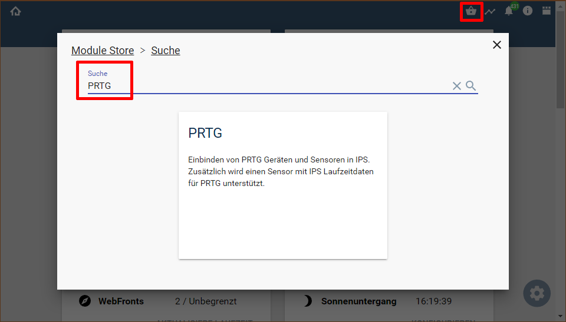

  

  
  

# Symcon-Modul: PRTG  <!-- omit in toc -->  

Einbinden von PRTG Geräten und Sensoren in Symcon.  

## Inhaltsverzeichnis <!-- omit in toc -->

- [1. Funktionsumfang](#1-funktionsumfang)
  - [PRTG IO:](#prtg-io)
  - [PRTG Konfigurator:](#prtg-konfigurator)
  - [PRTG Gerät:](#prtg-gerät)
  - [PRTG Sensor:](#prtg-sensor)
- [2. Voraussetzungen](#2-voraussetzungen)
- [3. Software-Installation](#3-software-installation)
- [4. Einrichten der Instanzen in IP-Symcon](#4-einrichten-der-instanzen-in-ip-symcon)
- [5. Anhang](#5-anhang)
  - [1. GUID der Module](#1-guid-der-module)
  - [2. Hinweise](#2-hinweise)
  - [3. Changelog](#3-changelog)
  - [4. Spenden](#4-spenden)
- [6. Lizenz](#6-lizenz)

## 1. Funktionsumfang

### [PRTG IO:](PRTGIO/)  

- Schnittstelle zwischen den Device und Sensor Instanzen und PRTG.  
- Empfangen von Events aus PRTG.  
- Bereitstellen von Symcon Systeminformation für einen PRTG-Sensor.  
- Abfragen von Graphen aus PRTG.  

### [PRTG Konfigurator:](PRTGConfigurator/)  

- Auflisten alle in PRTG verfügbaren Geräte und Sensoren.  
- Erstellen von neuen Device und Sensor Instanzen in Symcon.  

### [PRTG Gerät:](PRTGDevice/)  

- Empfangen und darstellen des aktuellen Zustand.  
- Pausieren und Fortsetzen der Überwachung über die Frontends, Aktionen und PHP-Scripten.  

### [PRTG Sensor:](PRTGSensor/)  

- Empfangen und darstellen des aktuellen Zustand.  
- Pausieren und Fortsetzen der Überwachung über die Frontends, Aktionen und PHP-Scripten.  
- Quittieren von Alarmmeldungen über die Frontends, Aktionen und PHP-Scripten.  

## 2. Voraussetzungen

- IP-Symcon ab Version 8.2
- PRTG

## 3. Software-Installation

Über den 'Module-Store' in Symcon das Modul 'PRTG' hinzufügen.  
**Bei kommerzieller Nutzung (z.B. als Errichter oder Integrator) wenden Sie sich bitte an den Autor.**  
  

Die Abfrage ob ein [Konfigurator](PRTGConfigurator/README.md#3-einrichten-der-instanzen-in-ip-symcon) Modul angelegt werden soll, ist zu bestätigen.
Es wird automatisch die Konfiguration für den benötigten [IO](PRTGIO/README.md#4-einrichten-der-instanzen-in-ip-symcon) abgefragt.

## 4. Einrichten der Instanzen in IP-Symcon

Details sind in der Dokumentation der jeweiligen Module beschrieben.  

In der Dokumentation des [PRTG IO](PRTGIO/) wird im Anhang erläutert wie eine Überwachung von Symcon aus PRTG erfolgen kann.  
Ebenso wird dort das Empfangen von Statusänderungen eines Sensors in Symcon erläutert, damit Symcon den Zustand zeitnah darstellen kann.  

Es wird dingend empfohlen somit zuerst den [PRTG IO](PRTGIO/) zu erstellen und fertig zu konfigurieren, sowie in PRTG alle gewünschten Einstellungen vorzunehmen, bevor weitere Instanzen in Symcon über den [PRTG Konfigurator](PRTGConfigurator/) angelegt werden.  

## 5. Anhang

### 1. GUID der Module

|       Modul       |     Typ      | Prefix |                  GUID                  |
| :---------------: | :----------: | :----: | :------------------------------------: |
|      PRTG IO      |     I/O      |  PRTG  | {67470842-FB5E-485B-92A2-4401E371E6FC} |
| PRTG Configurator | Configurator |  PRTG  | {32B8B831-91B2-44B5-9B66-9F1685647216} |
|    PRTG Device    |    Device    |  PRTG  | {95C47F84-8DF2-4370-90BD-3ED34C65ED7B} |
|    PRTG Sensor    |    Device    |  PRTG  | {A37FD212-2E5B-4B65-83F2-956CB5BBB2FA} |

### 2. Hinweise  

Der im [PRTG IO](PRTGIO/) verwendete Benutzer sollte in PRTG Administrative Rechte bekommen, um die Überwachung zu steuern und Alarme quittieren zu können.  
Die Kommunikation zwischen Symcon und PRTG kann sowohl per HTTP als auch per HTTPS (SSL/TLS) erfolgen.  
Hierzu ist PRTG und die URL im [PRTG IO](PRTGIO/) entsprechend zu anzupassen.
Unverschlüsselte Übertragung sollte niemals zur Kommunikation mit einem externen PRTG-Server genutzt werden, da die Login-Informationen dann nicht verschlüsselt übertragen werden!  

### 3. Changelog

**Version 2.60:**  

- Version für Symcon 8.2.  
- Umstellung von Profile auf Darstellungen.  
- Damit einher geht eine Anpassung der Einheiten aller Speicher / Bandbreitenvarialen der Sensoren.  
- Diese werden jetzt ohne Umrechnung immer als Byte/Bit gespeichert.
- Variablenhandling überarbeitet.  
- Die Einheiten aus PRTG werden zuverlässiger erkannt.  
- Fehlende Einheiten werden im LogFile protokolliert.  
- Wird aufgrund der Einheit ein andere Variablentyp benötigt, als aktuell vorhanden ist, so wird dies im LogFile protokolliert.  
- Die Instanz-Konfiguration liefert einen Überblick der Variablen mit ihren erkannten Einheiten und Variablentyp.  
- Der Symcon Sensor für PRTG enthält jetzt auch MessageQueueSize, MessageSlowCounter, durchschnittliche Laufzeit und Speicherverbrauch aller PHP-Threads
  
**Version 2.52:**  

- Version für Symcon 7.0.  
  
**Version 2.51:**  

- Sensor und Device Intervall konnte beim starten von Symcon falsch sein.  

**Version 2.50:**  

- Wurde ein Sensor pausiert, so wurden alle Statusvariablen neu als String angelegt und die alten somit gelöscht.  
- Aktionen hinzugefügt.  
- Dynamische Konfigurationsformulare und somit einfacher zu konfigurieren.  
- IO zeigt den Event Webhook für PRTG an.  
- Event Webhook mit verbesserten NAT Support.  
- Event Webhook unterstützt abweichenden Port (z.B. für NAT).  

**Version 2.30:**  

- Werte für Mbit/sek. und kbit/sek. waren um den Faktor 10 zu groß.  

**Version 2.20:**  

- Fehler im Symcon-Sensor behoben, wenn PRTG 'Keine Daten' als Nutzdaten übertragen hat.  

**Version 2.10:**  

- Fehler im Symcon-Sensor behoben, wenn Laufwerke keine Bezeichnung hatten  
- Fehler im Symcon-Sensor behoben, wenn Pagefile genutzt wird  

**Version 2.00:**  

- Release für Symcon 5.1 und den Module-Store  

**Version 1.36:**  

- Location Feld in create verschoben  

**Version 1.35:**  

- Fehler im Konfigurator, wenn die Kategorie in der Kategorieauswahl nicht auf oberster Ebene war.  
- Fehlende Übersetzung ergänzt.  
- Konfigurator meldet wenn IO nicht aktiv ist.  

**Version 1.31:**  

- Darstellungsfehler im Konfigurator beseitigt  
- Formen nutzen jetzt NumberSpinner mit Suffix anstatt IntervalBox  

**Version 1.30:**  

- Fehlerbehandlung Datenaustausch überarbeitet  
- Konfigurator erstellt Instanz unterhalb von Kategorien mit dem Namen des jeweiligen Gerätes  

**Version 1.20:**  

- Sensordaten eines SSL-Zertifikatssensor verursachten Fehler  

**Version 1.10:**  

- SSL Checks sind desaktivierbar  
- Sensorwerte mit Laufzeit Tage verursachten Fehler  

**Version 1.0:**  

- Erstes offizielles Release  

### 4. Spenden  
  
Die Library ist für die nicht kommerzielle Nutzung kostenlos, Schenkungen als Unterstützung für den Autor werden hier akzeptiert:  

  

  

## 6. Lizenz

IPS-Modul:  
[CC BY-NC-SA 4.0](https://creativecommons.org/licenses/by-nc-sa/4.0/)  
